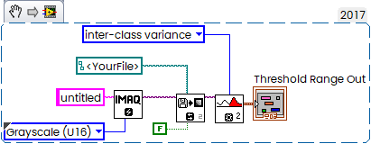

# otsu_exper
Some experiments with Otsu thresholding

An interesting fact is that different implementations produce slightly different threshold values:

|                                          | Zippo.tif | Circle.tif |
| ---------------------------------------- | --------- | ---------- |
| Rust naive                               | 9893      | 34036      |
| ImageJ (Fiji.app)                        | 9913      | 34341      |
| NI Vision (inter-class variance)         | 9812      | 33626      |
| Matlab                                   | 9893      | 34059      |
| Python (skimage.filters::threshold_otsu) | 9896      | 34036      |

Another interesting fact: my implementation gives the same results as Python and Matlab, but the values differ when applied to different images.

Rust code:

```rust
pub fn otsu_threshold_16bit(hist: &[i32]) -> u16 {
	const NUM_BINS: usize = 65536;
	debug_assert!(hist.len() == NUM_BINS);

	let mut total: u64 = 0;
	let mut sum: f64 = 0.0;

	for (i, &count) in hist.iter().enumerate() {
		let count = count as u64;
		total += count;
		sum += (i as f64) * (count as f64);
	}

	if total == 0 {
		return 0;
	}

	let mut sum_b = 0.0;
	let mut w_b = 0u64;
	let mut max_between = -1.0;
	let mut best_thresh = 0u16;

	for t in 0..NUM_BINS {
		let count = hist[t] as u64;
		w_b += count;
		if w_b == 0 {
			continue;
		}
		let w_f = total - w_b;
		if w_f == 0 {
			break;
		}

		sum_b += (t as f64) * (count as f64);
		let m_b = sum_b / (w_b as f64);
		let m_f = (sum - sum_b) / (w_f as f64);
		let between = (w_b as f64) * (w_f as f64) * (m_b - m_f) * (m_b - m_f);

		if between > max_between {
			max_between = between;
			best_thresh = t as u16;
		}
	}

	best_thresh
}

```

LabVIEW Code:



Python Script:

```python
import matplotlib.pyplot as plt
from skimage import io
from skimage.filters import threshold_otsu
import numpy as np

# Load 16-bit grayscale image (replace with your file path)
# filename = 'test_image.tif'  # Supports TIFF, PNG - use .tif for 16-bit
filename = 'img\\Circle.tif'  # Supports TIFF, PNG - use .tif for 16-bit
image = io.imread(filename, as_gray=True)

# Ensure it's 16-bit uint16
print(f"Image loaded: {filename}")
print(f"Shape: {image.shape}, Dtype: {image.dtype}, Range: [{image.min():.0f}, {image.max():.0f}]")

# Compute Otsu threshold
thresh = threshold_otsu(image)
print(f"Otsu threshold value: {thresh:.2f}")

# Binarize
binary = image > thresh

# Plot results
fig, axes = plt.subplots(ncols=3, figsize=(10, 3.5))
ax = axes.ravel()

ax[0].imshow(image, cmap=plt.cm.gray)
ax[0].set_title('Original 16-bit')
ax[0].axis('off')

ax[1].hist(image.ravel(), bins=1024)  # More bins for 16-bit data
ax[1].set_title('Histogram')
ax[1].axvline(thresh, color='r', linewidth=2)
ax[1].set_xlim(0, image.max())

ax[2].imshow(binary, cmap=plt.cm.gray)
ax[2].set_title(f'Thresholded (T={thresh:.0f})')
ax[2].axis('off')

plt.tight_layout()
plt.show()

```

MATLAB Script:

```matlab
% Script to load 16-bit grayscale image and compute Otsu threshold with otsuthresh

% Specify your 16-bit grayscale image file
% filename = 'test_image.tif';  % Replace with your file path (TIFF/PNG)
filename = 'img\Zippo.tif';  % Replace with your file path (TIFF/PNG)

% Read 16-bit image (uint16)
img = imread(filename);

% Verify grayscale
if size(img, 3) > 1
    error('Image must be grayscale.');
end

% Display image info
fprintf('Image: %s\nSize: %dx%d\nClass: %s\nRange: [%d, %d]\n', ...
    filename, size(img,1), size(img,2), class(img), ...
    double(min(img(:))), double(max(img(:))));

% Compute histogram (use 65536 bins for full 16-bit precision, or fewer for speed)
num_bins = 65536;  % Full 16-bit range; use 1024 or 4096 for faster computation
[counts, ~] = imhist(img, num_bins);

% Compute Otsu threshold from histogram counts (returns [0,1])
T_normalized = otsuthresh(counts);

% Convert to absolute threshold value
% max_val = double(max(img(:)));
max_val = 65536.0;

T_absolute = T_normalized * (max_val);  % Scale to image range

fprintf('Otsu threshold (normalized): %.4f\n', T_normalized);
fprintf('Otsu threshold (absolute): %.0f\n', T_absolute);

% Optional: Binarize and display results
BW = imbinarize(img, T_normalized);
figure;
subplot(1,2,1); imshow(img, []); title('Original 16-bit');
subplot(1,2,2); imshow(BW); title(sprintf('Binarized (T=%.4f)', T_normalized));

```

### Links

[Otsu's method](https://en.wikipedia.org/wiki/Otsu%27s_method).

[Otsu thresholding different result](https://forum.image.sc/t/otsu-thresholding-different-result/52206).

[Comparing different implementations of the same thresholding algorithm](https://haesleinhuepf.github.io/BioImageAnalysisNotebooks/29_algorithm_validation/scenario_otsu_segmentation.html).


